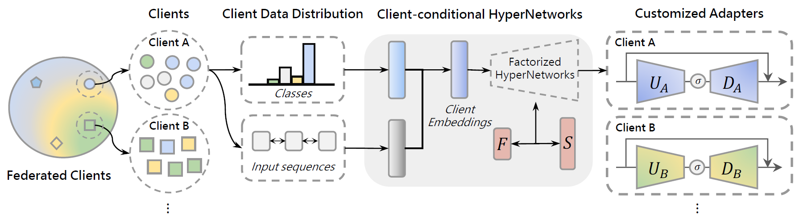

# Client-Customized Adaptation for Parameter-Efficient Federated Learning 

### Pytorch implementations of Client-Customized Adaptation for Parameter-Efficient Federated Learning (Findings of ACL: ACL 2023)

<p align='center'>
    
</p>

**Abstract**: Despite the versatility of pre-trained language models (PLMs) across domains, their large memory footprints pose significant challenges in federated learning (FL), where the training model has to be distributed between a server and clients. One potential solution to bypass such constraints might be the use of parameter-efficient fine-tuning (PEFT) in the context of FL. However, we have observed that typical PEFT tends to severely suffer from heterogeneity among clients in FL scenarios, resulting in unstable and slow convergence. In this paper, we propose Client-Customized Adaptation (C2A), a novel hypernetwork-based FL framework that generates client-specific adapters by conditioning the client information.  With the effectiveness of the hypernetworks in generating customized weights through learning to adopt the different characteristics of inputs, C2A can maximize the utility of shared model parameters while minimizing the divergence caused by client heterogeneity. To verify the efficacy of C2A, we perform extensive evaluations on FL scenarios involving heterogeneity in label and language distributions. Comprehensive evaluation results clearly support the superiority of C2A in terms of both efficiency and effectiveness in FL scenarios 

### Training C2A on XGLUE-NC dataset

~~~
python main.py 
    --dataset 'multi_sent' \
    --beta 0.5 \
    --model 'distilbert-base-multilingual-cased'  \
    --alg 'c2a' \
    --adapter 'hyper'  \
    --n_parties 100 \
    --batch_size 64 \
    --comm_round 20 \
    --sample_fraction 0.25
~~~


### Citation

```bibtex
@inproceedings{kim-etal-2023-client,
    title = "Client-Customized Adaptation for Parameter-Efficient Federated Learning",
    author = "Kim, Yeachan  and
      Kim, Junho  and
      Mok, Wing-Lam  and
      Park, Jun-Hyung  and
      Lee, SangKeun",
    booktitle = "Findings of the Association for Computational Linguistics: ACL 2023",
    month = jul,
    year = "2023",
    address = "Toronto, Canada",
    publisher = "Association for Computational Linguistics",
    url = "https://aclanthology.org/2023.findings-acl.75",
    doi = "10.18653/v1/2023.findings-acl.75",
    pages = "1159--1172",
}

```